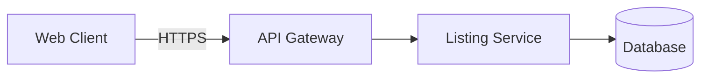
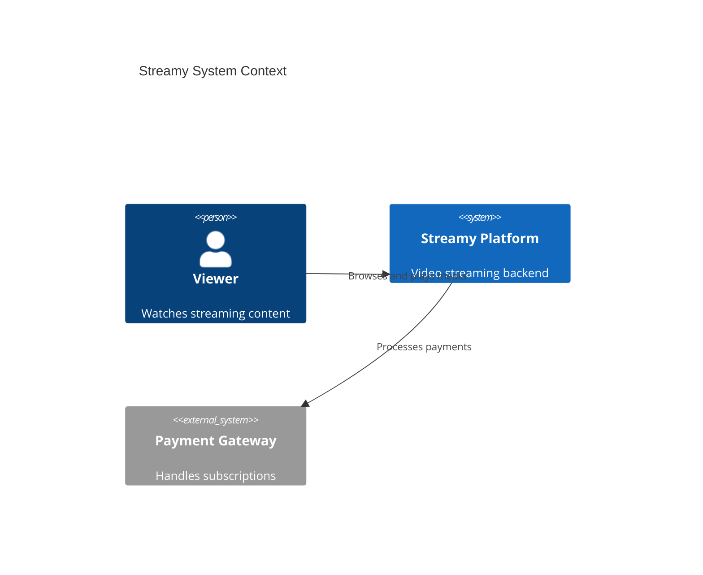

# Project Overview

This repository uses Mermaid for architecture and domain documentation.

```mermaid
flowchart LR
  Client[Web Client] -->|HTTPS| API[API Gateway]
  API --> Service[Listing Service]
  Service --> DB[(Database)]
```

```mermaid
C4Context
  title Streamy System Context
  Person(user, "Viewer", "Watches streaming content")
  System(streamy, "Streamy Platform", "Video streaming backend")
  System_Ext(payment, "Payment Gateway", "Handles subscriptions")
  Rel(user, streamy, "Browses and plays media")
  Rel(streamy, payment, "Processes payments")
```